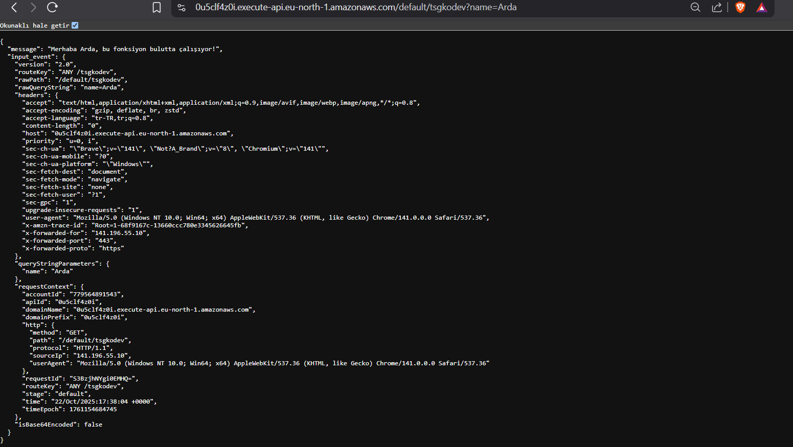
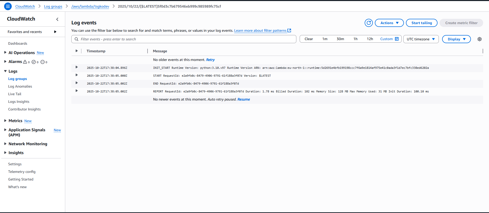

# ServerlessAws
# My First Serverless Function+ (Ödev Projesi)

Bu proje, AWS Lambda ve API Gateway kullanılarak geliştirilen sunucusuz (serverless) bir API ödevidir.

## 🎯 Fonksiyonun Yaptığı İş

Bu fonksiyon, bir HTTP GET isteği ile tetiklenir. Gelen istekte `?name=...` şeklinde bir sorgu parametresi (query string parameter) arar.

* Eğer `name` parametresi varsa (örn: `?name=Arda`), kişiselleştirilmiş bir selamlama mesajı döndürür.
* Eğer `name` parametresi yoksa, varsayılan bir selamlama mesajı döndürür.

Fonksiyon, sonucu `JSON` formatında döndürür.

* **Endpoint URL:** `https://0u5clf4z0i.execute-api.eu-north-1.amazonaws.com/default/tsgkodev`

## 🚀 Nasıl Deploy Edilir?

Bu fonksiyon AWS Konsolu üzerinden manuel olarak deploy edilmiştir:
1.  **AWS Lambda:** `Python 3.10` runtime seçilerek `tsgkodev` adında bir fonksiyon oluşturuldu.
2.  **IAM Rolü:** Fonksiyon için otomatik olarak `AWSLambdaBasicExecutionRole` yetkisine sahip bir IAM rolü oluşturuldu. Bu rol, fonksiyonun sadece CloudWatch'a log yazabilmesi için "en az yetki prensibine" (least privilege) uygundur.
3.  **Kod:** `lambda_function.py` dosyasındaki kod, Lambda konsolundaki kod editörüne yapıştırıldı ve "Deploy" edildi.
4.  **Tetikleyici:** Fonksiyona "API Gateway" tetikleyicisi eklendi. "HTTP API" tipi ve "Open" güvenlik ayarı seçilerek internetten erişilebilir bir API endpoint'i oluşturuldu.

## 🧪 Test Senaryosu (Örnek Input/Output)

API'yi test etmek için bir tarayıcı veya `curl` kullanılabilir.

### Senaryo 1: Parametreli İstek

**Input (İstek):**
```bash
curl "[https://0u5clf4z0i.execute-api.eu-north-1.amazonaws.com/default/tsgkodev?name=Arda](https://0u5clf4z0i.execute-api.eu-north-1.amazonaws.com/default/tsgkodev?name=Arda)"


{
  "message": "Merhaba Arda, bu fonksiyon bulutta çalışıyor!",
  "input_event": { ... }
}
Parametresiz İstek
Input (İstek):
curl "[https://0u5clf4z0i.execute-api.eu-north-1.amazonaws.com/default/tsgkodev](https://0u5clf4z0i.execute-api.eu-north-1.amazonaws.com/default/tsgkodev)"

Output (Çıktı):
{
  "message": "Merhaba dostum, bu fonksiyon bulutta çalışıyor!",
  "input_event": { ... }
}
#### Çalışan API Çıktısı (Parametreli)


#### Çalışan API Çıktısı (Parametresiz)

